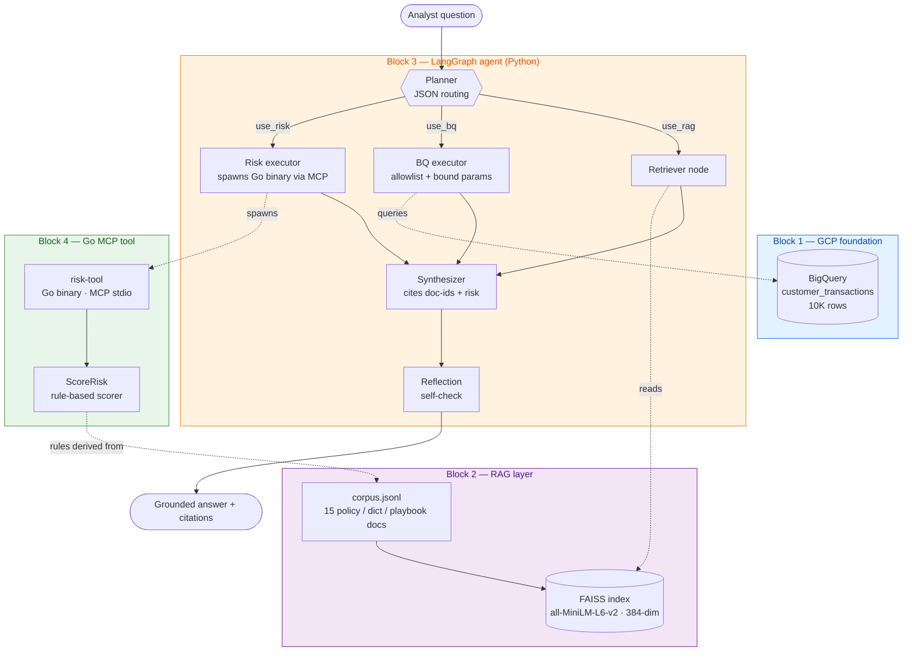

# Architecture

Single source of truth for how the system is wired and how a query flows
through it. README.md is the recruiter-facing pitch; per-block READMEs
are execution guides. Anything about **how the system works** lives here.

## Contents

1. [System overview](#1-system-overview)
2. [Component map](#2-component-map)
3. [Agent state graph](#3-agent-state-graph)
4. [AgentState schema](#4-agentstate-schema)
5. [Per-node responsibilities](#5-per-node-responsibilities)
6. [Cross-block data flow](#6-cross-block-data-flow)
7. [Tool safety model](#7-tool-safety-model)
8. [Observability layer](#8-observability-layer)
9. [Design decisions](#9-design-decisions)
10. [Evaluation layer](#10-evaluation-layer)
11. [Known limitations & deferred work](#11-known-limitations--deferred-work)

---

## 1. System overview

A FinTech risk-analyst Q&A agent. One natural-language question →
planner routes → parallel RAG + BigQuery tool execution → grounded
synthesis → reflection self-check → answer with citations.

Four physical components, one per build block:

| Block | Component | Role in the flow |
|---|---|---|
| 1 | BigQuery table `fintech_demo.customer_transactions` (10K synthetic rows) | Numeric source of truth — read by Block 3's BQ tool |
| 2 | 15-doc corpus + FAISS index (`all-MiniLM-L6-v2`, 384-dim) | Policy / definitions / playbook source — read by Block 3's retriever |
| 3 | LangGraph agent in Python (`block3/02_agent.py`) | The orchestrator — planner + 2 parallel tools + synthesizer + reflection |
| 4 | Go MCP risk-scoring tool (`block4/`) | Self-contained scorer, callable via MCP stdio. Stands alone today; documented integration path in `block4/README.md` |

All four pieces share **one domain** (NP credit risk: new buyer · Q1–Q4 ·
merchant segment travel/gaming/retail · JCIC fallback) so the demo tells
one coherent story, not four toy scripts.

**On top of the agent**: an offline evaluation pipeline (`eval/`) scores
the agent against a 20-question fixed testset on four standard Ragas
metrics — faithfulness, answer_relevancy, context_precision,
context_recall. See [§ 10](#10-evaluation-layer).

---

## 2. Component map



**Dotted edges = cross-block reuse:**

- Block 3's retriever reads Block 2's FAISS index directly
  (`../block2/faiss_index.bin`)
- Block 3's BQ executor queries Block 1's BigQuery table
- Block 3's risk_executor spawns Block 4's `risk-tool` Go binary over
  MCP stdio when `use_risk=true` — see `block3/02_agent.py:_call_risk_tool_async`
- Block 4's Go rules trace line-for-line to Block 2's corpus
  (policy-001 / policy-003 / policy-004 / playbook-004) — same source of
  truth, different language

---

## 3. Agent state graph

The LangGraph compiled in `block3/02_agent.py:271`:

```
START
  │
  ▼
┌──────────┐  emits JSON: {use_rag, use_bq, use_risk, bq_args, risk_args, reasoning}
│ planner  │  (gemini-2.5-flash, response_mime_type=application/json)
└──────────┘
  │
  ├──────────────────────┬─────────────────────┐    ← fan out (parallel)
  ▼                      ▼                     ▼
┌───────────┐    ┌──────────────┐    ┌─────────────────┐
│ retriever │    │ bq_executor  │    │ risk_executor   │  ← spawns Go binary
│ (FAISS)   │    │ (allowlisted │    │ (MCP stdio →    │     over MCP stdio
└───────────┘    │  bound SQL)  │    │  block4 risk-tool)│
                 └──────────────┘    └─────────────────┘
  │                      │                     │
  └──────────────────────┴─────────┬───────────┘    ← fan in (synthesizer waits for all)
                                   ▼
                          ┌──────────────┐
                          │ synthesizer  │  citations: [doc-id] + "(per the data table)" + "(per risk_score)"
                          └──────────────┘
                                   │
                                   ▼
                          ┌──────────────┐
                          │ reflection   │  self-check; outputs "OK" or one-line fix
                          └──────────────┘
                                   │
                                   ▼
                                  END
```

**LangGraph mechanics:**

- Edges from `planner` to `retriever`, `bq_executor`, `risk_executor` ⇒ three-way fan-out
- LangGraph waits for all three branches before invoking `synthesizer` ⇒ fan-in
- State merge is automatic: each node returns a dict, LangGraph merges
  those dicts into `AgentState` (no manual locking, no manual merging)

**Four test paths exercised by `block3/02_agent.py:DEMO_QUERIES`:**

| # | Question | use_rag | use_bq | use_risk |
|---|---|---|---|---|
| 1 | "What's our target unpaid rate, and how is `is_delinquent` defined?" | ✅ | ❌ | ❌ |
| 2 | "Show me delinquency rate broken down by quarter." | ❌ | ✅ | ❌ |
| 3 | "Q3 new-buyer delinquency feels high. What does the data show, and what's our SOP?" | ✅ | ✅ | ❌ |
| 4 | "A first-time travel buyer with no JCIC wants to spend TWD 25,000 — score, policy, segment baseline?" | ✅ | ✅ | ✅ |

---

## 4. AgentState schema

Defined at `block3/02_agent.py:96`:

```python
class AgentState(TypedDict, total=False):
    question:    str          # input
    plan:        dict         # planner: {use_rag, use_bq, use_risk, bq_args, risk_args, reasoning}
    retrieved:   list[dict]   # retriever: [{id, title, text, score}]
    bq_rows:     list[dict]   # bq_executor: aggregate rows
    bq_error:    str          # bq_executor: error path
    risk_result: dict         # risk_executor: {score, band, decision, contributions}
    risk_error:  str          # risk_executor: error path
    draft:       str          # synthesizer: answer text
    reflection:  str          # reflection: "OK" or one-sentence critique
```

`total=False` ⇒ all fields are optional. Each node populates only its own
keys; LangGraph merges. A skipped tool branch (e.g. `use_rag=False`)
simply returns `{}` and leaves `retrieved` unset — the synthesizer
checks for presence before using it.

---

## 5. Per-node responsibilities

### planner — `block3/02_agent.py:164`

| Field | Value |
|---|---|
| Input | `question` |
| Output | `plan` dict |
| LLM | gemini-2.5-flash, `response_mime_type=application/json`, `temperature=0.1` |
| Why JSON mode | Deterministic routing — planner cannot emit malformed text that breaks downstream nodes |
| Failure mode | JSON parse fail → fallback to `{use_rag: True, use_bq: False}` |

### retriever — `block3/02_agent.py:176`

| Field | Value |
|---|---|
| Input | `question`, `plan.use_rag` |
| Output | Top-3 docs `[{id, title, text, score}]` |
| Embeddings | `sentence-transformers/all-MiniLM-L6-v2`, normalized → cosine via FAISS IP |
| Skipped if | `use_rag=False` → returns `{}` |

### bq_executor — `block3/02_agent.py:184`

| Field | Value |
|---|---|
| Input | `question`, `plan.use_bq`, `plan.bq_args` |
| Output | Aggregate rows OR `bq_error` string |
| Calls | `delinquency_breakdown(group_by, filters)` from `block3/01_bq_tool.py:61` |
| Safety | Two-layer defense — see [§ 7](#7-tool-safety-model) |
| Skipped if | `use_bq=False` → returns `{}` |

### risk_executor — `block3/02_agent.py:risk_executor`

| Field | Value |
|---|---|
| Input | `question`, `plan.use_risk`, `plan.risk_args` |
| Output | `risk_result` dict `{score, band, decision, contributions}` OR `risk_error` string |
| Transport | MCP stdio — spawns `../block4/risk-tool` (Go binary) per call (~200ms incl. subprocess start) |
| Cross-language | Python orchestrator → Go binary → JSON response back. The schema is self-describing via MCP `tools/list`, so the planner could in principle discover the tool at runtime; here it's hard-coded in the planner prompt for simplicity |
| Skipped if | `use_risk=False` → returns `{}` |
| Fail-soft | If the Go binary isn't built (`block4/risk-tool` missing), returns a `risk_error` with a build instruction instead of crashing the graph |

### synthesizer — `block3/02_agent.py:216`

| Field | Value |
|---|---|
| Input | `question` + `retrieved` + `bq_rows` (or `bq_error`) + `risk_result` (or `risk_error`) |
| Output | `draft` — answer text with `[doc-id]` citations, "(per the data table)" for numeric claims, "(per risk_score)" for risk scorer outputs |
| Waits for | All three of retriever, bq_executor, risk_executor (LangGraph fan-in) |

### reflection — `block3/02_agent.py:252`

| Field | Value |
|---|---|
| Input | `evidence` (docs + data) + `draft` |
| Output | `"OK"` or one-sentence critique |
| Read-only | Does NOT rewrite the draft — transparency, not retry loop |
| Known false positive | See [§ 10](#10-known-limitations--deferred-work) |

---

## 6. Cross-block data flow

```
   ┌─────────────────────────────────────────────────────────┐
   │  block1/02_load_bigquery.py                             │
   │    → fintech_demo.customer_transactions (10K rows)      │
   └─────────────────────────────────────────────────────────┘
                                ▲
                                │  google.cloud.bigquery client
                                │  (parameterised SQL)
   ┌─────────────────────────────────────────────────────────┐
   │  block3/02_agent.py        bq_executor node             │
   └─────────────────────────────────────────────────────────┘

   ┌─────────────────────────────────────────────────────────┐
   │  block2/02_index_faiss.py                               │
   │    → block2/faiss_index.bin + doc_meta.jsonl            │
   └─────────────────────────────────────────────────────────┘
                                ▲
                                │  faiss.read_index()
                                │  + sentence-transformers
   ┌─────────────────────────────────────────────────────────┐
   │  block3/02_agent.py        retriever node               │
   │    BLOCK2 = Path(__file__).parent.parent / "block2"     │
   └─────────────────────────────────────────────────────────┘

   ┌─────────────────────────────────────────────────────────┐
   │  block2/corpus.jsonl       policy-001/003, playbook-004 │
   └─────────────────────────────────────────────────────────┘
                                ▲
                                │  hand-translated to typed Go rules
                                │  (no runtime read)
   ┌─────────────────────────────────────────────────────────┐
   │  block4/risk.go            ScoreRisk()                  │
   └─────────────────────────────────────────────────────────┘
```

**Why physically separated** (not unified Python package):

- Recruiter reads each block as a standalone artifact
- Numeric folder prefixes (`01_`, `02_`) aren't valid Python identifiers,
  so cross-block imports use `importlib.import_module` after `sys.path`
  injection — uglier than a package, but block directories stay flat and
  readable

---

## 7. Tool safety model

The planner is an LLM. It could be prompt-injected into emitting hostile
filter values. The BQ tool has **two-layer defense** at `block3/01_bq_tool.py:43`:

| Layer | What | What it stops |
|---|---|---|
| **Allowlist** | `group_by` columns and `filters` keys checked against `ALLOWED_DIMS` (`quarter`, `is_new_buyer`, `merchant_segment`, `device_type`) | LLM trying to query forbidden columns (e.g. `customer_id`) |
| **Parameter binding** | Filter VALUES bound via `bigquery.ScalarQueryParameter`, never string-interpolated | SQL injection in filter values |

**Verified** in `block3/01_bq_tool.py:155` (test 4):
`filters={"merchant_segment": "travel'; DROP TABLE x;--"}` → returns 0
rows (zero match), no SQL injection, no destructive side effect.

**Documented limitation**: column NAMES (in `SELECT`, `GROUP BY`, `WHERE
col =`) ARE string-interpolated, because BigQuery query parameters don't
support identifier substitution. The allowlist check is what makes this
safe — without it, this would be an injection vector.

---

## 8. Observability layer

Added in Block 5a. When env vars are set:

```bash
export LANGSMITH_TRACING=true
export LANGSMITH_API_KEY=lsv2_pt_...
export LANGSMITH_PROJECT=fintech-agent-demo
```

every LangGraph node + every LLM call surfaces as a trace tree in
LangSmith:

```
chain   5.49s  LangGraph                  ← root span (one query)
  chain   1.33s  planner                  ← LangGraph auto-traced node
    llm   1.33s  gemini-2.5-flash         ← @traceable on _gen()
  chain   0.13s  retriever                ← parallel branch — FAISS, local
  chain   1.95s  bq_executor              ← parallel branch — BigQuery, slower
  chain   1.52s  synthesizer
    llm   1.52s  gemini-2.5-flash
  chain   0.69s  reflection
    llm   0.68s  gemini-2.5-flash
```

The trace tree gives three things at a glance:

1. **Where time goes** — `bq_executor` (1.95s, network) vs `retriever`
   (0.13s, local FAISS) shows the parallel-branch latency win
2. **Where tokens go** — synthesizer is the heaviest LLM call by output
   tokens; planner and reflection are cheap routing/check calls
3. **Where failures would land** — each node is its own span, so a tool
   error or a JSON-parse failure shows up at the node boundary, not as
   an opaque agent crash

**Two layers of instrumentation:**

- **LangGraph auto-trace**: each compiled node becomes a span
  automatically when `LANGSMITH_TRACING=true`
- **`@traceable` on `_gen()`** (`block3/02_agent.py:118`): each Gemini
  call gets its own `llm`-type span with per-call token counts

`@traceable` is passthrough when env vars are unset → local runs stay
free and offline.

---

## 9. Design decisions

| Choice | Why |
|---|---|
| LangGraph with plain-Python nodes (no LangChain `ChatModel`) | Shows the orchestration pattern without dragging in LangChain's full ecosystem. Each node is a small `(state) -> dict` function — easy to read, easy to unit-test |
| Planner returns structured JSON (`response_mime_type=application/json`) | Deterministic routing; planner cannot emit malformed instructions that break downstream nodes |
| Parallel fan-out for retriever + bq_executor | Both are independent given the plan. LangGraph merges the resulting state automatically. Measurable latency win when both tools are needed |
| Reflection without retry loop | Just transparency — prints `OK` or one-line critique. Retry loops add complexity and risk divergence; out of scope for a 16-hr demo, and exposing the false-positive case is a better interview talking point than hiding it |
| `thinking_budget=0` on all LLM calls | Routing / synthesis / reflection are simple enough not to need 2.5-flash's hidden reasoning. Saves cost; also avoids the token-budget-eaten-by-thinking bug seen in Block 2 |
| FAISS `IndexFlatIP` + normalized vectors | Exact cosine on a 15-doc corpus — no HNSW/IVF tuning that doesn't matter at this scale. Production alternative (Vertex AI Vector Search) noted in `block2/README.md` |
| `all-MiniLM-L6-v2` (384-dim) embeddings | Small (~80MB), CPU-fast, sufficient at this scale. Production alternative: `text-embedding-004` via Vertex |
| `google-genai` SDK over `vertexai.generative_models` | The `vertexai` SDK is deprecated 2026-06-24 (~5 weeks from project start); `google-genai` is the supported path forward |
| Go MCP tool over plain CLI / REST | `tools/list` returns the JSON schema → tool is self-describing. Adding the tool to Block 3's planner would only require a generic MCP loader, not a per-tool wrapper |
| BQ allowlist + `ScalarQueryParameter` | LLM cannot inject SQL even under prompt-compromise. See [§ 7](#7-tool-safety-model) |

---

## 10. Evaluation layer

Lives in `eval/`. Two-stage pipeline that scores Block 3 agent output
against a 20-question fixed testset using Ragas metrics. Detailed
execution guide in [`eval/README.md`](./eval/README.md); this section
covers the architecture-level shape.

### Pipeline

```
eval/testset.jsonl             ← 20 hand-authored cases (rag_only / bq_only / both)
        │
        ▼
eval/01_run_agent.py           ← runs Block 3 LangGraph 20 times
        │                       (imports build_graph from block3/02_agent.py)
        ▼
eval/run_outputs.jsonl         ← cached (question, answer, contexts, plan, reflection)
        │
        ▼
eval/02_score_ragas.py         ← Ragas judges with gemini-2.5-flash
        │                       (faithfulness / answer_relevancy /
        │                        context_precision / context_recall)
        ▼
eval/scores.csv                ← per-question scores
eval/scores_aggregate.json     ← overall + per-tool-path slices
```

### Why two stages

Agent runs hit Vertex AI + BigQuery and cost real time + money.
Cache them once in `run_outputs.jsonl`; iterate on scoring (try a new
metric, change the judge, recompute aggregates) without re-paying for
agent runs.

### Testset construction

20 questions split across the three tool paths the planner can pick:

| Path | n | Purpose |
|---|---|---|
| `rag_only` | 6 | Pure policy / dict / playbook lookup — exercises retriever + synthesizer |
| `bq_only` | 6 | Pure aggregation — exercises bq_executor; retriever skipped |
| `both` | 8 | The headline analytical questions — exercises full fan-out + synthesis with mixed citations |

Each row carries `expected_doc_ids` and a hand-authored `ground_truth`
derived directly from `block2/corpus.jsonl`, so Ragas's
context_recall has something concrete to compare against.

### Why Ragas (and not a hand-rolled scorer)

- **Standard vocabulary** — "faithfulness 0.87" is immediately
  readable to anyone in the LLM-eval ecosystem; a custom metric needs
  explanation each time
- **Standard methodology** — claim-decomposition for faithfulness,
  question-regeneration for relevancy are documented patterns with
  published validations
- **One-line metric additions** — `answer_correctness`,
  `context_entity_recall`, `semantic_similarity` etc. add as one
  metric-list entry

Trade-off worth naming: the Ragas LLM judge introduces its own noise.
Absolute scores are a sanity floor; the real value is in **comparing
versions** (before/after a prompt tweak, before/after a retrieval
change) where the same judge applies the same noise to both.

### Known artifact: BQ-only context metrics

For `bq_only` questions the retriever is skipped, so the only
"context" passed to the judge is the formatted BQ aggregate table.
context_precision/recall are not designed to score that — they assume
retrieved documents. The aggregate report flags this as a per-path
slice (see `scores_aggregate.json`); faithfulness and
answer_relevancy remain meaningful for all 20 questions.

### First-run results (2026-05-18, judge = flash thinking-on — superseded)

| Metric | All (n=20) | rag_only (6) | bq_only (6) | both (8) |
|---|---|---|---|---|
| faithfulness | 0.832 | 0.967 | 0.833 | 0.729 |
| answer_relevancy | 0.730 | 0.864 | 0.883 | **0.515** |
| context_precision | 0.857 | 0.972 | 0.833 | 0.788 |
| context_recall | 0.423 | 0.328 | 0.250 | 0.625 |

This pass cost **USD ~13** because the Ragas judge ran with thinking
ON by default. The judge model has since been swapped to
`gemini-2.5-flash-lite`; expect these numbers to shift on a re-run,
since a different judge is a different rater. Full breakdown in
[`eval/README.md` Cost post-mortem](./eval/README.md#cost-post-mortem).

**Real planner regression surfaced** (5 of 20 cases): the planner
sometimes emits `filters: {is_delinquent: True}` — but `is_delinquent`
is the outcome the BQ tool aggregates, not a dimension in
`ALLOWED_DIMS`. The BQ tool correctly raises `ToolInputError`; the
agent falls back to "insufficient evidence" or doc-only answers, and
Ragas scores those low. Fix: tighten the planner prompt at
`block3/02_agent.py:135` to call out that `is_delinquent` is the
outcome (not a filter dimension). Tracked as a follow-up; out of
scope for the eval addition itself.

**Judge artifacts** (separate from the above): several `rag_only`
cases have `context_recall ≈ 0` despite `faithfulness = 1.0` and
`context_precision = 1.0` — the agent retrieved the right doc and
grounded its answer, but the Ragas judge appears to parse
`(per policy-001)` in the ground_truth as its own atomic claim and
look for a literal doc-id string in the contexts. Persistent
"LLM returned 1 generations instead of requested 3" warnings add
extra noise (Vertex returns one generation per call; Ragas wants
self-consistency n=3).

The eval pipeline is doing its job: low scores on the `both` path
point at a fixable agent bug, while the `rag_only`
`context_recall = 0.328` is mostly judge-side noise that would benefit
from a multi-judge or self-consistency upgrade rather than an agent
change. Full per-question detail in `eval/scores.csv` and
`eval/run_outputs.jsonl` (both gitignored — regen with the two scripts
in `eval/`).

---

## 11. Known limitations & deferred work

### Reflection false positive on Q3

On the Q3 new-buyer query, the reflection node flags the `[dict-004]`
citation as ungrounded — but `dict-004` explicitly states "Q3 new-buyer
delinquency typically runs 1.5-2.0 percentage points above the annual
average". Deliberately kept as-is: demonstrates that reflection nodes
themselves can err. This is exactly why the demo's reflection is
transparency-only (no retry loop overwriting a correct draft).

### Block 5b — Cloud Run deploy deferred

Per the plan's cut order, LangSmith observability (5a) was prioritized
over Cloud Run (5b). The trace tree gives the observability story
without needing a public URL that a recruiter likely wouldn't click.
Will revisit before the Google Cloud AI Engineer submission.

### Block 4 integration into Block 3 — DONE

The Go MCP tool is now a routed branch of the agent graph. See
`risk_executor` in [§ 5](#5-per-node-responsibilities), the `use_risk`
edge in [§ 3](#3-agent-state-graph), and the cross-block "spawns" edge
in the Mermaid map at [§ 2](#2-component-map). The 4th demo query in
`block3/02_agent.py:DEMO_QUERIES` exercises all three tools in parallel.
A zero-LLM smoke test (`PROJECT_ID=dummy python -c "...
_call_risk_tool_sync({...})..."`) confirms the MCP path works at the
protocol level without needing Gemini credits.
