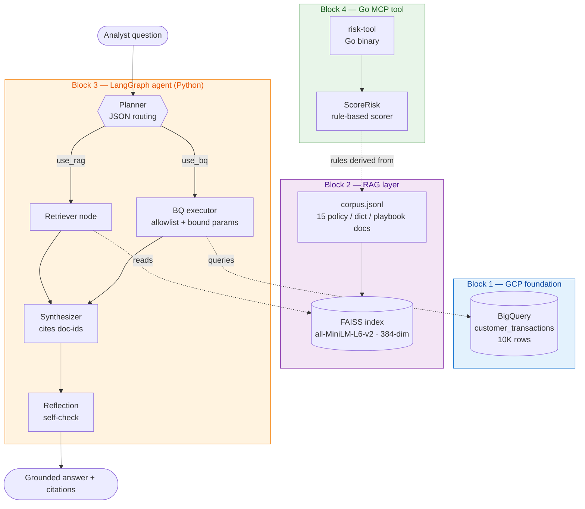

# Vertex AI + LangGraph FinTech Agent

> A runnable FinTech risk-analyst Q&A agent on Google Cloud — Vertex AI Gemini · BigQuery · sentence-transformers + FAISS RAG · LangGraph orchestration · Go-written MCP tool.
> Built as a deliberate cross-stack rewrite of an internal Claude Code + MCP agent, with side-by-side observations on where each pattern shines.

| | |
|---|---|
| **Status** | Blocks 1–4 of 6 shipped (foundation → RAG → LangGraph agent → Go MCP tool). Block 5 (Cloud Run + LangSmith) and Block 6 polish in progress |
| **Cumulative LLM spend** | ~USD 0.02 across all demo runs (gemini-2.5-flash, ~20 calls) |
| **Reproducibility** | `git clone` → 4 `pip install`s + 1 `brew install go` → 4 `python` runs. Total wall-clock for a fresh machine: ~30 min including model download |

---

## What this is

The agent answers questions a FinTech risk analyst would actually ask — _"Q3 new-buyer delinquency feels high, what do the numbers say, and what's our SOP?"_ — by combining:

1. **Grounded retrieval** over a small corpus of credit policies, data-dictionary entries, and risk-ops playbooks (Block 2)
2. **Aggregations** over a synthetic 10K-row transaction table in BigQuery (Block 1 + 3)
3. **Tool calling** orchestrated as a LangGraph state machine that decides per-query which tools to invoke and runs them in parallel (Block 3)
4. **A Go-written MCP tool** that exposes a rule-based credit-risk scorer the agent could call (Block 4) — proves Go + MCP fluency, not just a Python-only stack

The synthetic FinTech domain (new vs returning buyer, Q1–Q4, merchant segments travel/gaming/retail, JCIC fallback) is deliberately the same domain across all four blocks, so the demo tells **one coherent story** rather than four toy scripts.

---

## Architecture



The dotted edges are the **cross-block reuse story**:
- Block 3's retriever reads Block 2's FAISS index directly (`../block2/faiss_index.bin`)
- Block 3's BQ executor queries Block 1's BigQuery table
- Block 4's Go rules trace line-for-line to Block 2's corpus docs (policy-001, policy-003, playbook-004 …) — same source of truth, different language

---

## Walkthrough: one query end-to-end

Real output from `block3/02_agent.py`, Q3:

```
Q: Q3 new-buyer delinquency feels high. What does the data show,
   and what's our SOP for investigating a quarterly spike?

PLAN  use_rag=True  use_bq=True
      bq_args={'group_by': ['quarter', 'is_new_buyer'],
               'filters':  {'quarter': 'Q3', 'is_new_buyer': True}}
      reasoning: needs both policy SOP and actual numbers

RETRIEVED (FAISS top-3):
  score=0.664  [playbook-003] Quarterly spike investigation SOP
  score=0.658  [dict-004]    Data dictionary: quarter field
  score=0.643  [playbook-001] Quarterly delinquency review playbook

BQ ROWS:
  | quarter | is_new_buyer | n    | delinquency_pct | avg_order_value_twd |
  |---------|--------------|------|-----------------|---------------------|
  | Q3      | True         | 1030 | 7.57            | 4463.55             |

ANSWER:
  The Q3 new-buyer delinquency rate is 7.57% (per the data table). This is
  higher than the typical Q3 new-buyer delinquency, which historically runs
  1.5–2.0 percentage points above the annual average [dict-004].

  To investigate a quarterly spike, the SOP is triggered when a quarter's
  delinquency exceeds the trailing 4-quarter average by more than 1.0
  percentage points [playbook-003]. The SOP involves decomposing by
  is_new_buyer and merchant_segment, checking for shifts in order_value
  distribution, cross-referencing external data vendor signals, and proposing
  parameter adjustments within 5 business days [playbook-003]. Q3 spikes are
  often driven by new buyers and travel [playbook-003].

REFLECTION: ...
```

Three things worth noting:
- The **plan** is structured JSON, not free-form text — routing is deterministic
- The **retriever and BQ tool ran in parallel** (LangGraph fan-out), so synthesizer waited for both
- Every numeric claim is tagged "(per the data table)" and every policy claim cites `[doc-id]` — the answer is **fully auditable** back to either the BigQuery row or the corpus doc

---

## Stack choices

| Layer | Choice | Why |
|---|---|---|
| LLM | Vertex AI Gemini 2.5 Flash via `google-genai` SDK | JD keyword; flash is cheap and fast; `google-genai` is the SDK that replaces the soon-to-be-EOL `vertexai.generative_models` |
| Embeddings | `sentence-transformers/all-MiniLM-L6-v2` (384-dim) | Small (~80MB), CPU-fast, plenty for a 15-doc corpus. README notes the production alternative (Vertex `text-embedding-004`) |
| Vector store | FAISS `IndexFlatIP` with normalised vectors | Exact cosine on a small corpus — no HNSW/IVF tuning that doesn't matter at this scale |
| Orchestration | LangGraph `StateGraph` with parallel fan-out | Demonstrates ReAct + hierarchical delegation with a real state machine, not just chained prompts |
| Tool calling | Python tool (BQ aggregator) + Go tool over MCP (`mark3labs/mcp-go`) | One Python tool stays in-process; the Go tool proves the language boundary works via real MCP protocol, not framework magic |
| Tool safety | Allowlist on dimensions + `ScalarQueryParameter` binding | The planner LLM could be prompt-injected — allowlist + bound params keep the worst case "zero rows", never SQL injection |
| Data | BigQuery with 10K-row synthetic schema mirroring NP credit-risk | Same domain across all blocks; story stays coherent |

---

## Cross-stack comparison: Vertex+LangGraph vs Claude Code+MCP

The same agent shape (planner → retriever || tool-exec → synth → reflection) can be built on either stack. Where they differ in practice:

| Concern | Vertex + LangGraph (this demo) | Claude Code + MCP (internal platform) |
|---|---|---|
| **Graph topology** | Explicit `StateGraph` with named nodes and typed `AgentState`. Fan-out/fan-in is a first-class concept | Implicit — the model decides when to call which tool inside a single conversation turn. Topology lives in the prompt, not in code |
| **Tool registration** | LangChain-style `bind_tools()` or hand-rolled like in this demo. Python-centric ecosystem | MCP stdio JSON-RPC, language-agnostic. Adding a Go / Rust / TypeScript tool is _the_ supported path, not a workaround |
| **Stateful conversations** | LangGraph checkpointers (Postgres / SQLite). Need to wire it up | Built-in — Claude Code persists context across turns, and `claude.md` files act as durable context primitives |
| **Observability** | LangSmith integration is one decorator away (Block 5) — gives token cost per call + trace replay | Per-message reasoning visible in the IDE; harder to programmatically capture and analyse |
| **Self-reflection** | Add a `reflection` node to the graph (this demo has one). Output is a structured field on `AgentState` | Use a sub-agent invocation. More expressive, less constrained |
| **Deployment** | Cloud Run + Docker + a port. Production-shaped | The Claude Code platform runs the agent; "deployment" is more like sharing a `.claude/` config |

### Three observations

1. **Graph-first vs prompt-first.** LangGraph forces you to draw the state machine explicitly. That's great for review and onboarding, slower for prototyping. Claude Code + MCP is the opposite — fast to start, easier to lose the topology when it grows.
2. **MCP wins for language diversity, LangChain wins for Python depth.** Block 4 (Go MCP) added a new language to the agent in ~3 hours. Doing that on a pure-Python LangChain stack would have meant writing a Python wrapper around the Go binary.
3. **Reflection isn't a silver bullet.** This demo's reflection node occasionally flags _correctly-cited_ statements as ungrounded (Q3 case in `block3/02_agent.py`). It's transparency, not truth. Both stacks would have this problem; the difference is whether the loopback is graph-explicit (LangGraph) or implicit (sub-agent in Claude Code).

---

## Run it yourself

```bash
# One-time setup
brew install go                                       # for Block 4
pip install faker pandas google-cloud-bigquery \
            google-cloud-aiplatform sentence-transformers \
            faiss-cpu langgraph langchain-core mcp \
            --break-system-packages

# GCP project (or substitute your own; budget alert at USD 5 recommended)
gcloud auth application-default login
export PROJECT_ID="<your-gcp-project>"
export GCP_REGION="us-central1"

# Block 1 — GCP foundation
python block1/01_generate_data.py     # → customer_transactions.csv (10K rows)
python block1/02_load_bigquery.py     # → fintech_demo.customer_transactions
python block1/03_vertex_hello.py      # → "BLOCK 1 COMPLETE ✅"

# Block 2 — RAG baseline
python block2/01_build_corpus.py      # → corpus.jsonl (15 docs)
python block2/02_index_faiss.py       # → faiss_index.bin (~5min first run, model download)
python block2/03_rag_gemini.py        # → 5 grounded Q&A + "BLOCK 2 COMPLETE ✅"

# Block 3 — LangGraph agent
python block3/01_bq_tool.py           # → BQ tool tests incl. SQL-injection probe
python block3/02_agent.py             # → 3 e2e queries + "BLOCK 3 COMPLETE ✅"

# Block 4 — Go MCP tool
cd block4 && go build -o risk-tool .
python demo_client.py                 # → 3 risk decisions + "BLOCK 4 COMPLETE ✅"
```

---

## What's in each block

| Block | Focus | Key file | Block-level README |
|---|---|---|---|
| 1 | GCP project + Gemini + BigQuery | `block1/03_vertex_hello.py` | [block1/README.md](./block1/README.md) |
| 2 | RAG with FAISS, 15 hand-curated docs | `block2/03_rag_gemini.py` | [block2/README.md](./block2/README.md) |
| 3 | LangGraph agent with parallel tools | `block3/02_agent.py` | [block3/README.md](./block3/README.md) |
| 4 | Go MCP tool (risk scorer) | `block4/main.go` + `block4/risk.go` | [block4/README.md](./block4/README.md) |

Each block's README has its own execution guide, design rationale, and "what this means for the JD keywords" section.

---

## Cost discipline

| Item | Cost |
|---|---|
| Block 1: 5 Gemini hello-world calls | ~USD 0.005 |
| Block 2: 5 RAG grounding calls | ~USD 0.005 |
| Block 3: 3 agent runs × ~3 LLM calls each | ~USD 0.01 |
| Block 4: zero LLM calls (offline Go + Python) | USD 0 |
| **Total so far** | **~USD 0.02** |

`gemini-2.5-flash` with `thinking_budget=0` is the cheap, predictable choice. A USD 5 budget alert is set on the project as a tripwire — see `block1/00_SETUP_COMMANDS.md`.

---

## What's next

- **Block 5** — Containerise the Block 3 agent with Docker, deploy to Cloud Run, add LangSmith for token-cost-per-trace observability. Demonstrates the deployment + observability story the JD asks for
- **Block 6** _(this README is part of it)_ — top-level polish, Mermaid diagram, cross-stack comparison

---

## Author

Aaron Hung — Lead Data Scientist, 10+ yrs FinTech (banking, payments, credit risk). Currently exploring AI / agentic systems. [github.com/aaronhung215](https://github.com/aaronhung215)
